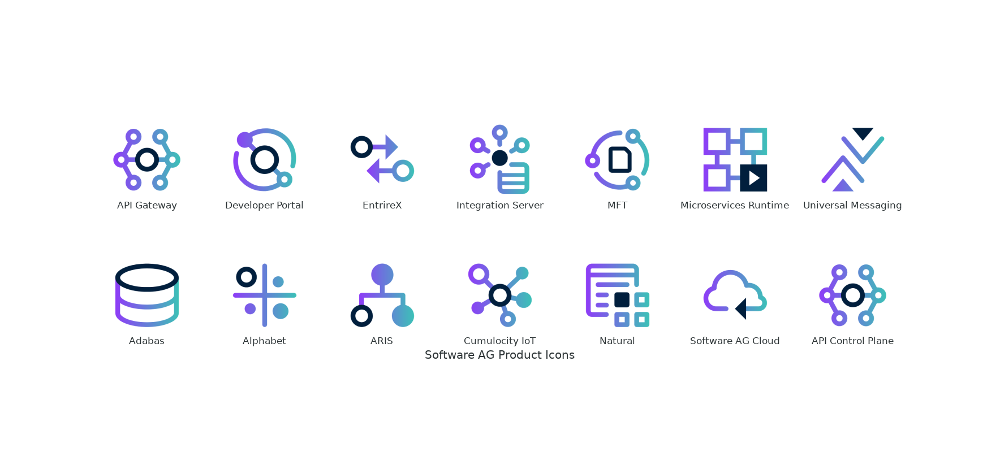
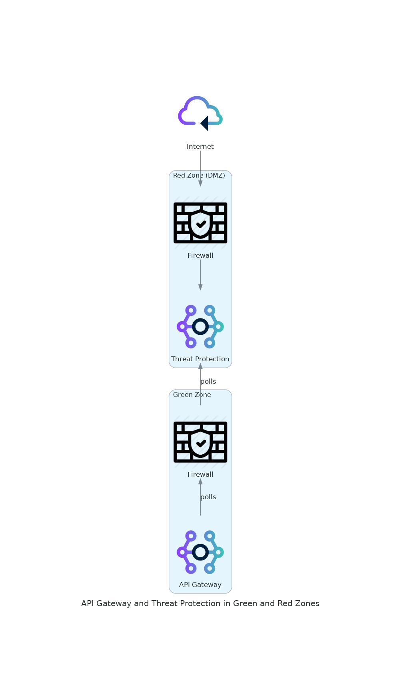

# Software AG Product Icons @ Diagrams as Code

We want to use the Software AG product icons in folder [./product-icons](./product-icons) to draw network diagrams as (text) code with [mingrammer](https://diagrams.mingrammer.com/). There are a lot of advantages to do this:

* All icons has the same size.
* You don't need to layout the diagram.
* The edges are automatically routed.
* The diagram is automatically drawn.
* You can save the code in VCS and have a history.
* If the network (diagram) is changed, you can easily update the text (with a simple text editor).
* You need only a text editor.

Here is the first [demo diagram](./diagrams/sag-demo.py) with a subset of icons:



To draw a network diagram with Software AG product icons, you must import the URLs to `.png` icon files.

```
  # Import Software AG icons, here is a subset ...
  
  # Adabas
  ada_url  = "https://github.com/SoftwareAG/webmethods-ui-assets/raw/main/product-icons/256x256/Adabas-256x256.png"
  ada_icon = "Adabas-256x256.png.tmp"
  urlretrieve(ada_url, ada_icon)

  # Alphabet
  alphabet_url  = "https://github.com/SoftwareAG/webmethods-ui-assets/raw/main/product-icons/256x256/Alfabet-256x256.png"
  alphabet_icon = "Alfabet-256x256.png.tmp"
  urlretrieve(alphabet_url, alphabet_icon)

  # ARIS
  aris_url  = "https://github.com/SoftwareAG/webmethods-ui-assets/raw/main/product-icons/256x256/ARIS-256x256.png"
  aris_icon = "ARIS-256x256.png.tmp"
  urlretrieve(aris_url, aris_icon)

  # Cumulocity IoT
  c8y_url  = "https://github.com/SoftwareAG/webmethods-ui-assets/raw/main/product-icons/256x256/Cumulocity_IoT-256x256.png"
  c8y_icon = "Cumulocity_IoT-256x256.png.tmp"
  urlretrieve(c8y_url, c8y_icon)

  # Natural
  nat_url  = "https://github.com/SoftwareAG/webmethods-ui-assets/raw/main/product-icons/256x256/Natural-256x256.png"
  nat_icon = "Natural-256x256.png.tmp"
  urlretrieve(nat_url, nat_icon)
  
  # Software AG Cloud
  cloud_url  = "https://github.com/SoftwareAG/webmethods-ui-assets/raw/main/product-icons/256x256/Software_AG_Cloud-256x256.png"
  cloud_icon = "Software_AG_Cloud-256x256.png.tmp"
  urlretrieve(cloud_url, cloud_icon)

  # API Control Plane
  apicp_url  = "https://github.com/SoftwareAG/webmethods-ui-assets/raw/main/product-icons/256x256/webMethods_API_Control_Plane-256x256.png"
  apicp_icon = "webMethods_API_Control_Plane-256x256.png.tmp"
  urlretrieve(apicp_url, apicp_icon)

  # API Gateway
  apigw_url  = "https://github.com/SoftwareAG/webmethods-ui-assets/raw/main/product-icons/256x256/webMethods_API_Gateway-256x256.png"
  apigw_icon = "webMethods_API_Gateway-256x256.png.tmp"
  urlretrieve(apigw_url, apigw_icon)

  # Developer Portal
  devpo_url  = "https://github.com/SoftwareAG/webmethods-ui-assets/raw/main/product-icons/256x256/webMethods_Developer_Portal-256x256.png"
  devpo_icon = "webMethods_Developer_Portal-256x256.png.tmp"
  urlretrieve(devpo_url, devpo_icon)

  # EntireX
  exx_url  = "https://github.com/SoftwareAG/webmethods-ui-assets/raw/main/product-icons/256x256/webMethods_EntireX-256x256.png"
  exx_icon = "webMethods_EntireX-256x256.png.tmp"
  urlretrieve(exx_url, exx_icon)

  # Integration Server
  is_url  = "https://github.com/SoftwareAG/webmethods-ui-assets/raw/main/product-icons/256x256/webMethods_Integration_Server-256x256.png"
  is_icon = "webMethods_Integration_Server-256x256.png.tmp"
  urlretrieve(is_url, is_icon)

  # MFT
  mft_url  = "https://github.com/SoftwareAG/webmethods-ui-assets/raw/main/product-icons/256x256/webMethods_MFT-256x256.png"
  mft_icon = "webMethods_MFT-256x256.png.tmp"
  urlretrieve(mft_url, mft_icon)

  # Microservices Runtime
  msr_url  = "https://github.com/SoftwareAG/webmethods-ui-assets/raw/main/product-icons/256x256/webMethods_Microservices_Runtime-256x256.png"
  msr_icon = "webMethods_Microservices_Runtime-256x256.png.tmp"
  urlretrieve(msr_url, msr_icon)

  # Universal Messaging
  um_url  = "https://github.com/SoftwareAG/webmethods-ui-assets/raw/main/product-icons/256x256/webMethods_Universal_Messaging-256x256.png"
  um_icon = "webMethods_Universal_Messaging-256x256.png.tmp"
  urlretrieve(um_url, um_icon)
  
  # ... end of importing

```

Copy and paste above text to your diagram code. (The diagram generator downloads the icons and store them into local folder. You can delete the temporary `*.tmp` files.)

Now, we want to *draw* a diagram with API Gateway deployment in typical network environment with *Green* and *Red* zones. The Treat Protection (= API Gateway Standard Edition) is deployed in *Red* zone. [mingrammer](https://diagrams.mingrammer.com/) has many icons (Firewall, Load Balancers, Sub-Network, ...) which we can use to increase the diagram.



[Here](./diagrams/apigw-tp.py) is the diagram code. Additionally, we want to drill down in a [API Gateway cluster](./diagrams/apigw-tp-cluster.py) deployment with Elasticsearch.


